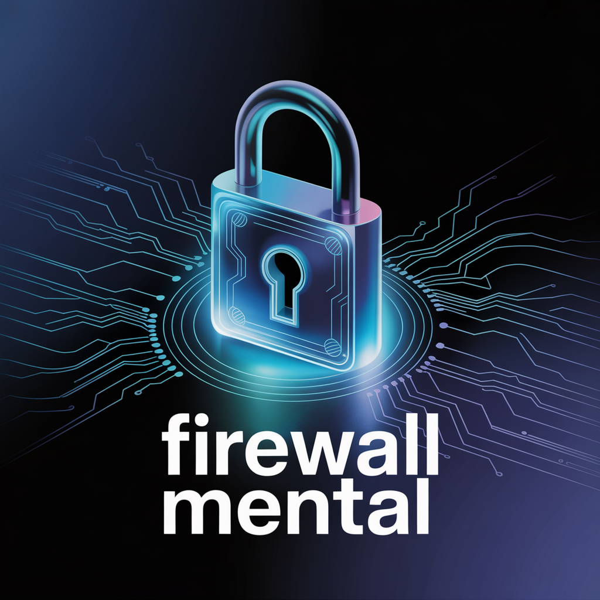

# 🎙️ Podcast Gerado por I.A - Segurança Digital

<p align="center">
  
  
</p>

<div align="center">
  
</div>

---

## 📋 Sobre o Projeto

O **Podcast Gerado por I.A. - Segurança Digital** é um projeto desenvolvido a partir de uma atividade da [DIO](https://dio.me), baseado em um fork de um repositório original. O objetivo é **explorar o uso de Inteligência Artificial em todas as etapas de criação de um podcast**, desde o roteiro até a edição final do áudio. O episódio aborda conceitos fundamentais de **segurança digital**, apresentados de forma acessível, com **exemplos práticos** e uma **abordagem didática e informativa**.

---

## 🧠 Temas Abordados

| Tema                                      | Descrição                                            |
| :---------------------------------------- | :--------------------------------------------------- |
| 🔐 **VPNs (Redes Privadas Virtuais)**     | Proteção de dados e navegação anônima.               |
| 🔑 **Gerenciadores de Senhas**            | Armazenamento seguro e automatizado.  |
| 🧩 **Autenticação Dupla (2FA)** | Camada adicional de segurança para acessos.          |
| 💻 **Protocolos e Endereços MAC**         | Fundamentos de rede e identificação de dispositivos. |

---

## 🛠️ Tecnologias Utilizadas

* 🤖 **[ChatGPT](https://chat.openai.com/)** – Criação do roteiro, prompts e estrutura base do conteúdo.
* 🗂️ **[NotebookLM](https://notebooklm.google.com/)** – Síntese, resumo e aprimoramento narrativo.
* 🎨 **[Ideogram](https://ideogram.ai/)** – Criação da imagem de capa do episódio.
* 🎧 **[CapCut](https://www.capcut.com/pt-br/)** – Edição de áudio, mixagem e inserção de trilha sonora.

---

## 🚀 Como Reproduzir o Projeto

Siga o fluxo abaixo para criar seu próprio **podcast automatizado com IA**:

```markdown
1️⃣ Gere o roteiro no ChatGPT com prompts personalizados.  
2️⃣ Busque artigos e notícias sobre os temas para serem carregados no NotebookLM.  
3️⃣ Use o NotebookLM para sintetizar e transformar textos em narração.  
4️⃣ Crie a arte da capa no Ideogram com base no tema do episódio.  
5️⃣ Edite e finalize o áudio no CapCut, adicionando trilhas e efeitos.    
```

---

## 🌟 Resultados

O projeto demonstra o potencial das IAs generativas aplicadas à **produção de conteúdo multimídia**, unindo criatividade, automação e acessibilidade tecnológica.

Além de funcionar como um estudo prático de integração entre ferramentas, ele mostra como um único criador pode construir um produto de mídia completo utilizando apenas recursos digitais inteligentes.

---

## 📂 Estrutura do Projeto

```bash
prompts-for-podcast-generate-by-ia/
├─ assets/
│  ├─ banner.webp
│  └─ github.txt
├─ output/
│  └─ podcast_editado.mp3
├─ src/
│  └─ prompts/
│     ├─ chatgpt.md
│     ├─ ideogram.md
│     └─ notebooklm.md
├─ .gitignore
└─ README.MD
```

---

## 💪 Como Contribuir

Contribuições são bem-vindas!
Para sugerir melhorias, siga os passos abaixo:

1. Faça um fork deste repositório
2. Crie uma branch: `git checkout -b feature/sua-feature`
3. Commit suas alterações: `git commit -m "feat: minha melhoria"`
4. Faça o push: `git push origin feature/sua-feature`
5. Abra um Pull Request descrevendo suas alterações

---

## 📝 Licença
Este projeto está sob a licença MIT.
Consulte o arquivo [LICENSE](https://github.com/devAndreotti/devAndreotti/blob/main/LICENSE) para mais detalhes.

<br>

---

<p align="center">
  Desenvolvido com ☕ por <a href="https://github.com/devAndreotti">Ricardo Andreotti Gonçalves</a> 🧑‍💻
</p>